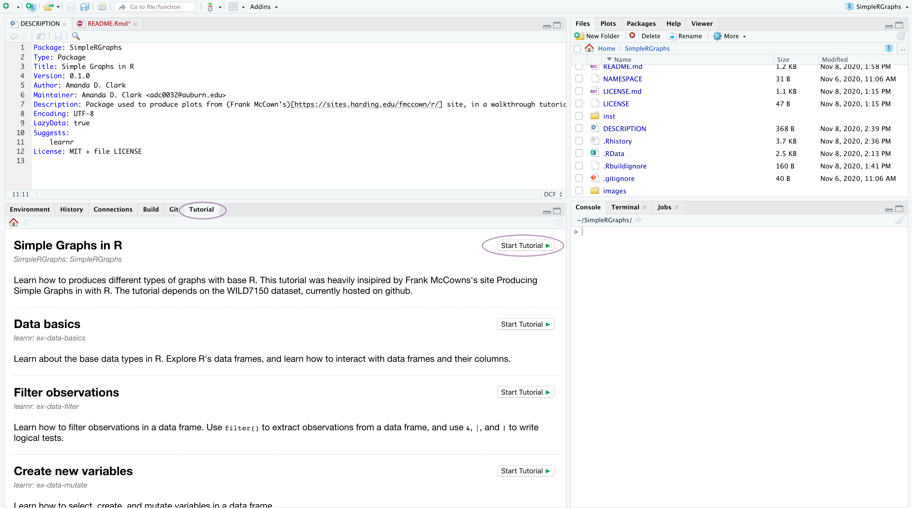

<!-- README.md is generated from README.Rmd. Please edit that file -->

```{r, include = FALSE}
knitr::opts_chunk$set(
  collapse = TRUE,
  comment = "#>",
  fig.path = "man/figures/README-",
  out.width = "100%"
)
```

# SimpleRGraphs

<!-- badges: start -->
<!-- badges: end -->

The goal of the SimpleRGraphs tutorial is to learn base R functions that will help visualize data in a step-wise, interactive tutorial.

## BIOL 5800/6800 Students
Once complete, this tutorial should address the **following learning objectives**:

* Learn to create different graphs using basic R functions
  + Line Graphs
  + Bar Graphs 
  + Pie Graphs
  + Histograms
  + Dot Graphs
* Learn to manipulate and customize graphs created with base R
* Apply rendering methods from video lectures to create a PDF of graphs

## Installation

#### First install some packages!
_If you do not have `learnr` & `devtools` installed already, use the commented(#) lines in the code chunks below **before** running `library()`_

**First**: You will need `learnr` to run this tutorial (or create your own - [learnr documentation](https://rstudio.github.io/learnr/index.html)):

```r
# Run the install line ONCE and then comment it out afterwards
install.packages("learnr")

library(learnr)
```


**Second**: Install the development version of the tutorial from [GitHub](https://github.com/) with devtools:

``` r
# Run the install line ONCE and then comment it out afterwards
install.packages("devtools")

library(devtools)
```
#### Now install the tutorial!

This tutorial was built in and works within Rstudio. The packages developed for this tutorial are hosted on Github, so you will need to install them.

**Third**: This tutorial package has an accompanying data package that can be accessed from [GitHub](https://github.com/) with:

```r
# Run the install each line ONCE and then comment them out afterwards
devtools::install_github("AUCompBio-Fall24/SimpleRGraphs")
devtools::install_github("adc0032/WILD7150")
```
The package also requires `tidyverse`.

``` r
# Run the install line ONCE and then comment it out afterwards
install.packages("tidyverse")

library(tidyverse)
```

If you forget this last one, you should be prompted to install if you do not have it installed already. 


## Running the tutorial in RStudio

To start the tutorial, you should now have a "Tutorial" tab, where you can access "Simple Graphs in R" by clicking **Start Tutorial**
This will start the tutorial **in an Rstudio window**


Note: if you want to stop the tutorial and come back to it another time, click the stop sign in RStudio. Otherwise it will run in the background using your computer's resources. 

#### Troubleshooting

I you encounter an error installing the packages aove, you may need to install additional software **outside** of RStudio on your main OS. 

* **Mac Users** may need [Xcode developer tools from the App store](https://developer.apple.com/xcode/features/) in order to use `devtools`  

* **Windows Users** may need [Rtools from CRAN](https://cran.r-project.org/bin/windows/Rtools/) in order to use `devtools`

If you get an error that asks you to "force" it is because you have already installed the package. Running the code again will give you this message. You do not need to do anything else. See above on how to run the tutorial.
